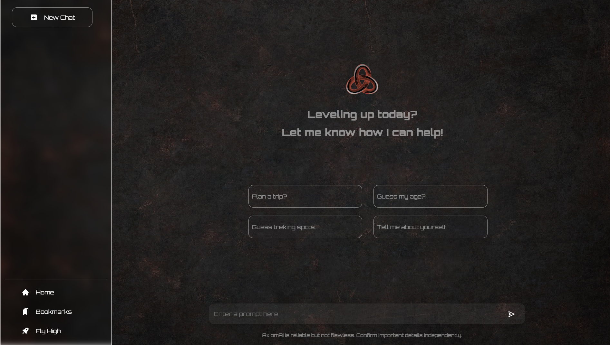
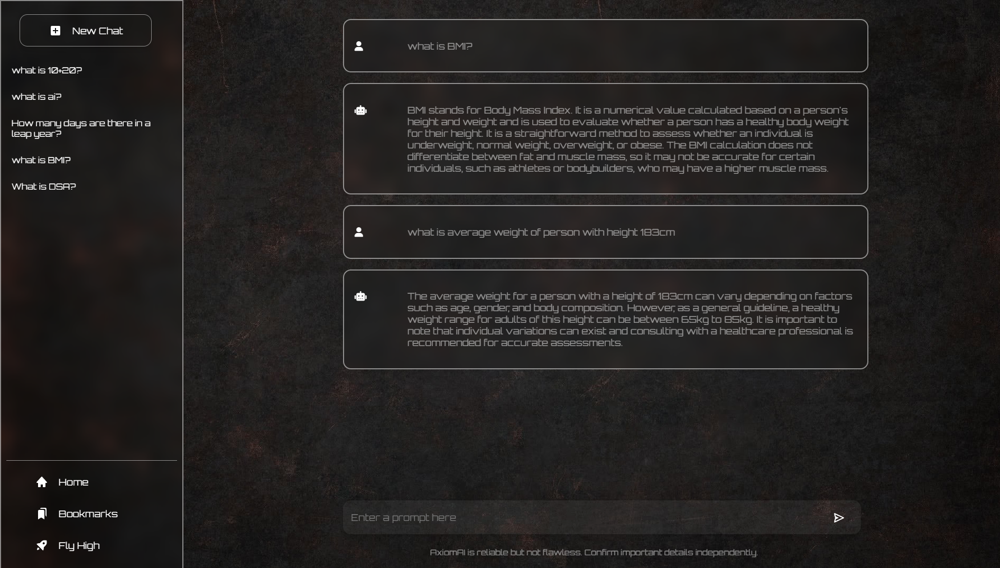

<h1>AxiomAI :Project Overview</h1>

<h2>Introduction</h2>

AxiomAI is a comprehensive project harnessing the power of OpenAI's ChatGPT 3.5 Turbo
API. Built with a ReactJS frontend and a Node.js backend for server-side operations and
API integration, AxiomAI aims to create an intelligent chatbot capable of delivering
contextually relevant responses.

<h2>Technology Used</h2>
<ul>
<li><b>OpenAI's ChatGPT 3.5 Turbo API:</b> Providing the underlying language model engine for
generating responses through its powerful text generation capabilities.</li>
<li><b>ReactJS:</b> Creates a dynamic and visually appealing user interface for interacting with the
ChatGPT 3.5 Turbo-powered chatbot.</li>
<li><b>Node.js:</b> Handles server-side operations, facilitates seamless integration with the ChatGPT
3.5 Turbo API, and manages backend logic for efficient communication.</li>
<li><b>JavaScript (Node.js):</b> The primary programming language for backend development,
ensuring smooth interaction with the Node.js runtime environment.</li>
<li><b>Additional libraries:</b> Specific libraries for API integration might be employed, depending
on the chosen solution, to further enhance communication with the ChatGPT 3.5 Turbo
API.</li>
</ul>

